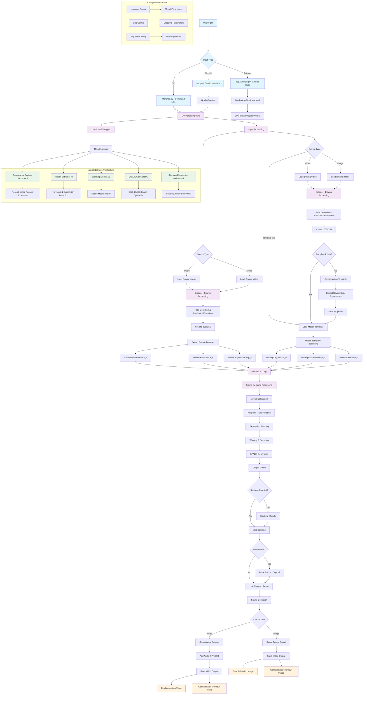

# LivePortrait System Workflow

## Architecture Overview

This document provides a comprehensive visual overview of the LivePortrait system architecture and processing pipeline.

## Quick Visual Reference

### Entry Points
```
User Input → [Web UI | CLI | Animals]
├── app.py (Gradio Interface)
├── inference.py (Command Line)
└── app_animals.py (Animal Mode)
```

### Core Processing Pipeline
```
Input Processing → Face Detection → Feature Extraction → Animation Loop → Output
     ↓                  ↓               ↓                ↓              ↓
Source/Driving     Crop & Align    Neural Networks   Frame-by-Frame   Video/Image
```

### Neural Network Modules
```
F: Appearance Feature Extractor (ResNet-based)
M: Motion Extractor (Keypoints & Expressions)
W: Warping Module (Dense Motion Fields)
G: SPADE Generator (High-Quality Synthesis)
S&R: Stitching/Retargeting (Boundary Smoothing)
```

## Detailed System Flow Diagram

**📺 To view this diagram properly:**
1. Copy the Mermaid code below
2. Paste it into [Mermaid Live Editor](https://mermaid.live)
3. Or use any Markdown viewer that supports Mermaid rendering

### Interactive Mermaid Diagram



## Simplified Text-Based Workflow

### 📥 Input Phase
```
1. User provides inputs:
   ├── Source: Image or Video (person to animate)
   └── Driving: Video, Image, or .pkl template (motion to apply)

2. System validates and loads inputs
   ├── Format validation (JPG, PNG, MP4, etc.)
   └── Face detection check
```

### 🔍 Processing Phase
```
3. Face Detection & Cropping:
   ├── Detect faces using InsightFace
   ├── Extract 68 facial landmarks
   └── Crop to 256x256 resolution

4. Feature Extraction:
   ├── Source → Appearance features (f_s) via Module F
   └── Driving → Motion features (keypoints, expressions) via Module M

5. Motion Template:
   ├── Create/load motion template (.pkl file)
   └── Cache for privacy and speed
```

### 🎬 Animation Phase
```
6. Animation Loop (for each frame):
   ├── Calculate motion vectors
   ├── Transform keypoints
   ├── Blend expressions
   ├── Warp using Module W
   └── Generate frame using Module G (SPADE)

7. Post-Processing:
   ├── Optional: Stitching for smooth boundaries
   └── Optional: Paste back to original resolution
```

### 📤 Output Phase
```
8. Output Generation:
   ├── Collect animated frames
   ├── Assemble video (if multiple frames)
   ├── Add audio (if present)
   └── Save final results
```

## Key Components

### 🎭 Core Architecture
- **LivePortraitPipeline**: Main orchestrator for human portraits
- **LivePortraitWrapper**: Neural network interface and inference engine  
- **Cropper**: Face detection, landmark extraction, and image preprocessing
- **GradioPipeline**: Web UI interface layer

### 🧠 Neural Network Modules
- **F (Feature Extractor)**: Extracts appearance features from source
- **M (Motion Extractor)**: Detects keypoints and expressions from driving
- **W (Warping Module)**: Creates dense motion fields for animation
- **G (SPADE Generator)**: Synthesizes high-quality output frames
- **S&R (Stitching/Retargeting)**: Smooths face boundaries and enables control

### 🔄 Processing Flow
1. **Input → Preprocessing → Feature Extraction**
2. **Motion Template Creation/Loading**
3. **Frame-by-frame Animation Loop**
4. **Post-processing → Output Generation**

### 💾 Key Data Structures
- **Motion Templates (.pkl)**: Cached keypoint/expression data
- **Keypoints (x_s, x_d)**: 3D facial landmarks
- **Expressions (exp_s, exp_d)**: Facial expression parameters
- **Features (f_s)**: Deep appearance representations

### ⚙️ Configuration System
- **InferenceConfig**: Model parameters and inference settings
- **CropConfig**: Face detection and cropping parameters
- **ArgumentConfig**: User-configurable options and flags

### 📤 Output Formats
- **Videos**: Final animation, concatenated preview, with audio
- **Images**: Single frame outputs for image-driven animation
- **Templates**: Motion templates (.pkl) for reuse and privacy

## Processing Stages

### Stage 1: Input Processing
- Load and validate source/driving inputs
- Support for images, videos, and motion templates
- Format validation and preprocessing

### Stage 2: Face Detection & Cropping
- InsightFace-based face detection
- 68-point facial landmark extraction
- Crop faces to 256x256 resolution

### Stage 3: Feature Extraction
- Extract appearance features using Module F
- Extract motion features using Module M
- Process keypoints and expressions

### Stage 4: Motion Template Processing
- Create motion templates from driving videos
- Cache templates as .pkl files for reuse
- Load existing templates for fast processing

### Stage 5: Animation Loop
- Frame-by-frame processing
- Motion calculation and keypoint transformation
- Expression blending and warping
- High-quality frame synthesis

### Stage 6: Post-processing
- Optional stitching for seamless boundaries
- Paste back to original image resolution
- Quality enhancement and filtering

### Stage 7: Output Generation
- Frame collection and video assembly
- Audio processing and synchronization
- File export in multiple formats

## Technical Specifications

### Performance
- **Processing Speed**: ~30-60 FPS on RTX 4090
- **Memory Usage**: 2-6GB GPU memory
- **Output Resolution**: 256x256 (with paste-back to original)

### Dependencies
- PyTorch (neural network inference)
- OpenCV (image processing)
- InsightFace (face detection)
- Gradio (web interface)
- FFmpeg (video processing)

### Hardware Requirements
- **GPU**: NVIDIA GPU with CUDA support (recommended)
- **RAM**: 8GB+ for smooth processing
- **Storage**: 10GB+ for model checkpoints

---

*This workflow diagram provides a comprehensive overview of the LivePortrait system architecture, enabling developers to understand the complete processing pipeline from input to output.*